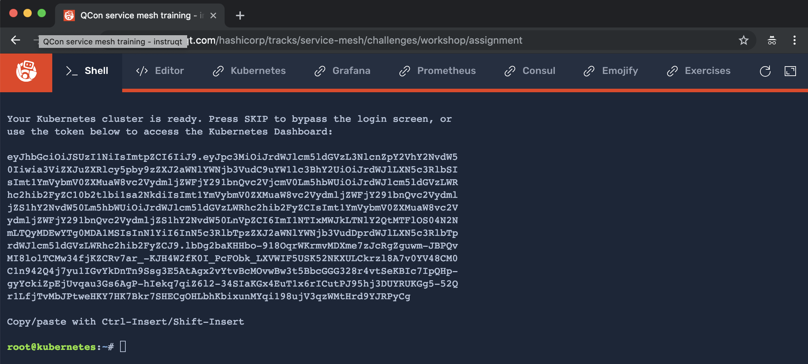

# [Lab 01](../index.md), Exercise 01: Get Familiar with Environment

**Objective**: Launch Service Mesh environment on Instruqt and explore its features.

For this workshop, we'll be using the [Instruqt](), an online interactive learning platform. All you need is a web browser. Chrome or Firefox recommended. You may need to disable ad blockers or allow-list Instruqt.

## Step 1: Create an account on Instruqt

_Note: This step is optional but highly recommended._

Navigate to [instruqt.com](https://instruqt.com) and create an account or sign in if you already have an Instruqt account. Signing in allows your work to be saved in progress.

## Step 2: Start workshop track

The track for this workshop is [https://instruqt.com/hashicorp/tracks/service-mesh/](https://instruqt.com/hashicorp/tracks/service-mesh/). Navigate there and click **start.**

## Step 3: Explore Instruqt environment



When the track starts, you'll see **eight (8)** tabs:

* **Shell:** Interactive command line.
* **Editor:** Visual editor and file navigator.
* **Kubernetes:** Kubernetes dashboard.
* **Grafana:** [Grafana](https://grafana.com) metrics dashboard and graph editor.
* **Prometheus:** [Prometheus](https://prometheus.io) monitoring system.
* **Consul:** Consul Web UI.
* **Emojify:** Sample multi-tiered web app deployment we'll implement a service mesh for.
* **Exercises:** These exercises, for ease of reference.

When you first begin the track, the Grafana, Prometheus, Consul, and Emojify tabs will display a `Connecting to the service...` message. This is expected. You'll configure those services as you proceed through the workshop.

If you prefer command line editors, you'll be happy to know that vim, emacs, and pico are all available in the **Shell** tab. If you prefer a visual editor, use the **Editor** tab. You can also mix and match!

If you're using the visual editor, the correct directory is already loaded for you.

If you're using the command line, you'll need to change into `service-mesh-training`:

```
cd service-mesh-training
```

