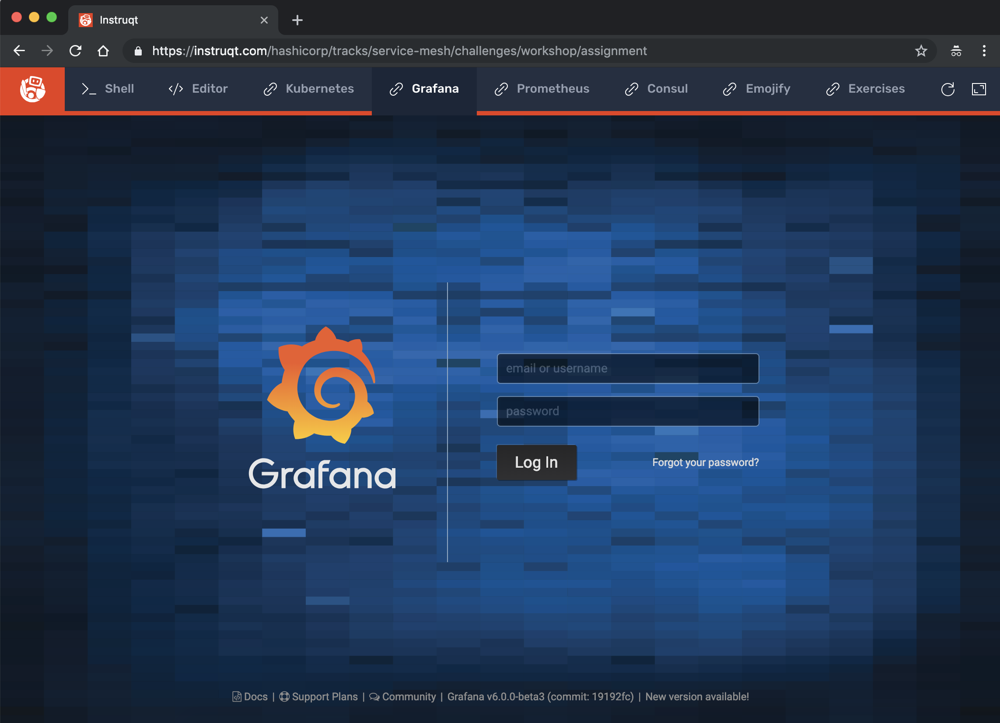
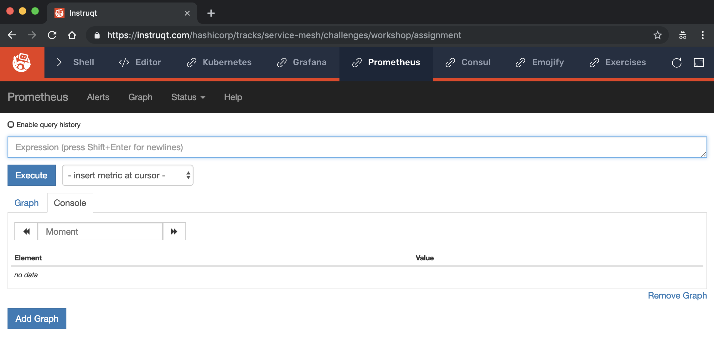

# Lab 01, Exercise 04: Install Prometheus and Grafana

**Objective:** Install [Prometheus](https://prometheus.io) and [Grafana](https://grafana.com) into Kubernetes cluster.

## Step 1: Install Prometheus and Grafana

First, navigate to this exercise's directory:

```
cd ~/service-mesh-training/exercises/lab-01/04-install-prometheus-and-grafana/
```

Install Prometheus with `kubectl apply`:

```
kubectl apply -f files/prometheus

configmap/prometheus-server-conf created
clusterrole.rbac.authorization.k8s.io/prometheus created
clusterrolebinding.rbac.authorization.k8s.io/prometheus created
service/prometheus created
service/grafana created
statefulset.apps/prometheus-statefulset created
daemonset.apps/prometheus-statsd created
```

Install Grafana with `kubectl apply`:

```
kubectl apply -f files/metrics-server

clusterrole.rbac.authorization.k8s.io/system:aggregated-metrics-reader created
clusterrolebinding.rbac.authorization.k8s.io/metrics-server:system:auth-delegator created
rolebinding.rbac.authorization.k8s.io/metrics-server-auth-reader created
apiservice.apiregistration.k8s.io/v1beta1.metrics.k8s.io created
serviceaccount/metrics-server created
deployment.extensions/metrics-server created
service/metrics-server created
clusterrole.rbac.authorization.k8s.io/system:metrics-server created
clusterrolebinding.rbac.authorization.k8s.io/system:metrics-server created

```

## Step 2: Verify installation

With `kubectl` to ensure the pods are running:

```
$ kubectl get pods
NAME                                        READY   STATUS    RESTARTS   AGE
emojify-api-external-cache-788c9964-vs688   3/3     Running   0          10m
emojify-cache-879fdccb7-4464c               3/3     Running   1          10m
emojify-facebox-7b4fdc8b5b-j4b46            3/3     Running   0          10m
emojify-ingress-7b697c574b-zhj76            3/3     Running   0          10m
emojify-loadtest-bf6d754d-8rdvn             1/1     Running   0          71s
emojify-website-5dd8ff4b55-jfn8z            3/3     Running   0          10m
jaunty-cheetah-consul-klfdj                 1/1     Running   0          16m
jaunty-cheetah-consul-server-0              1/1     Running   0          16m
prometheus-statefulset-0                    2/2     Running   0          2m29s
prometheus-statsd-h4hg2                     1/1     Running   0          2m29s
```

Click on the **Grafana** tab in Instruqt and you should see the Grafana user interface:



The default credentials are username **admin** and password **admin**.

We won't be using it much for this workshop, but you can also see the **Prometheus** dashboard on that tab:


