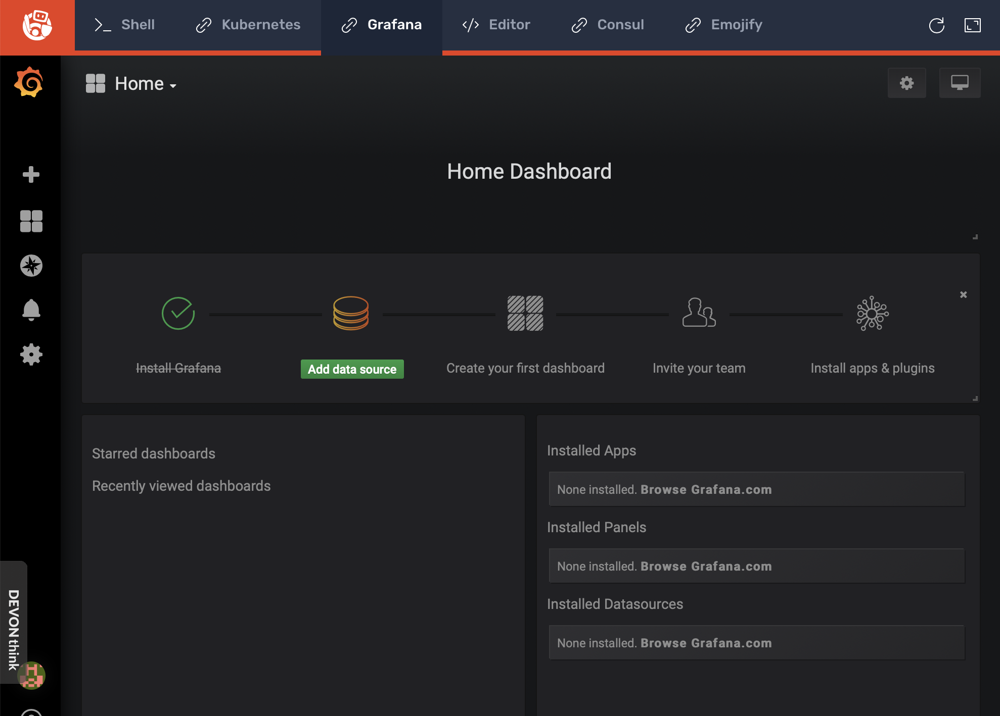
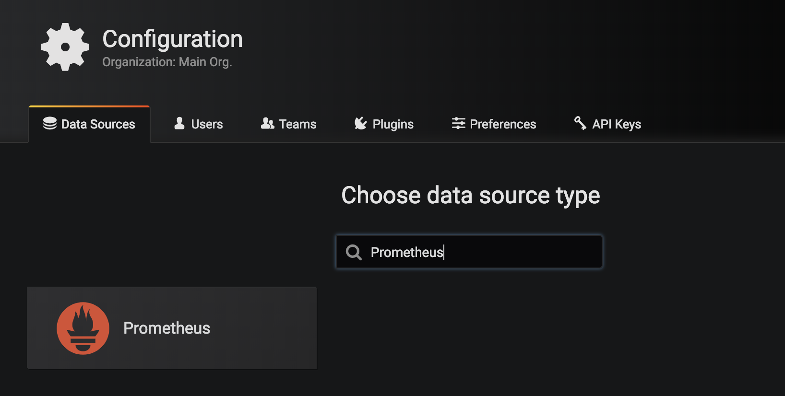
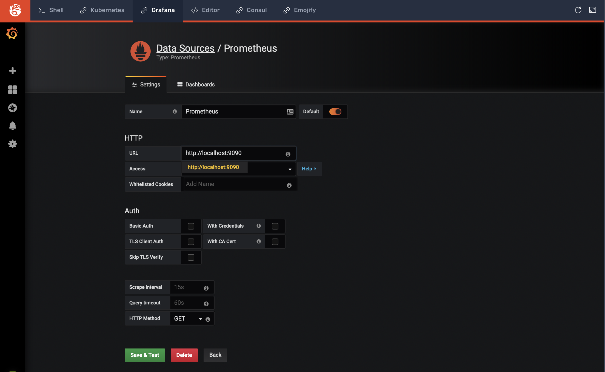

# Lab 01, Exercise 05: Configure Grafana

**Objective:** Configure Grafana for use with Prometheus and add a custom dashboard.

## Step 1: Add Prometheus data source

Go to the **Grafana** tab and login if you haven't already. The default user/password is **admin/admin**.

You should see the Home Dashboard:

Click **Add data source** and then select **Prometheus** on the following screen.

The default values are all sufficient. The **HTTP URL** is `http://localhost:9090`:

Click **Save & Test**.
