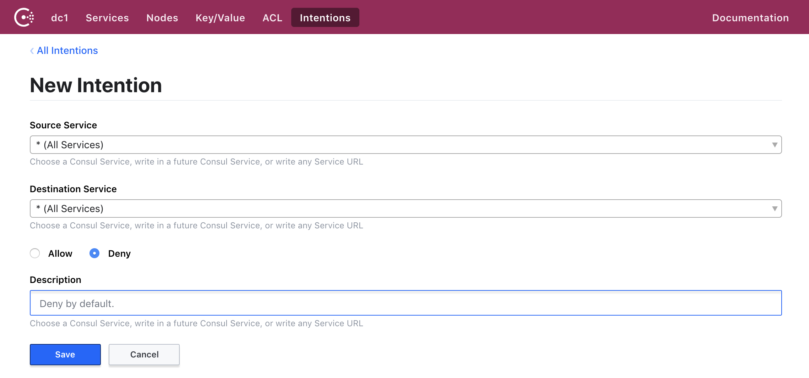
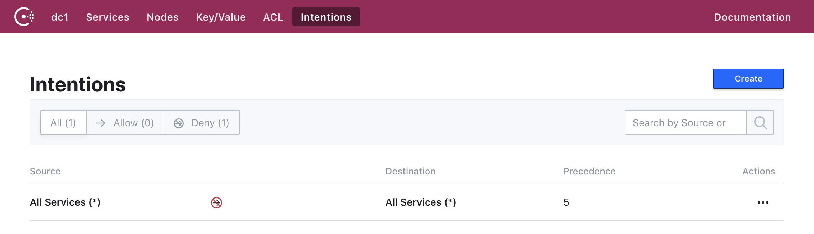
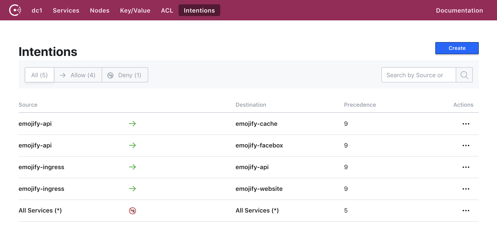

# Lab 02, Exercise 02: Configure Intentions

**Objective:** Enable secure service to service communication by configuration Consul intentions.

## Background

Intentions define access control for services via Connect and are used
to control which services may establish connections. Intentions can be
managed via the API, CLI, or UI.

Intentions are enforced by the [proxy](/docs/connect/proxies.html)
or [natively integrated application](/docs/connect/native.html) on
inbound connections. After verifying the TLS client certificate, the
[authorize API endpoint](#) is called which verifies the connection
is allowed by testing the intentions. If authorize returns false the
connection must be terminated.

The default intention behavior is defined by the default
[ACL policy](/docs/guides/acl.html). If the default ACL policy is "allow all",
then all Connect connections are allowed by default. If the default ACL policy
is "deny all", then all Connect connections are denied by default.

## Step 1 Add deny all rule

Intentions are configured via the Consul API, command line client, or Consul UI. We'll use the UI for this exercise.

Open the **Consul** tab in Instruqt. Click **Intentions** and then **Create**.

For deny all rule you'll set the following values:

- **Source Service:** * (All Services)
- **Destination Service:** * (All Services)
- **Allow/Deny:** Deny
- **Description:** Deny by default.

Click **Save**. You should now see the intention listed:

Now try to use Emojify and see what happens! What do you notice?

## Step 2: Add individual intentions

Now you'll need to create intentions for each of the service to service communication routes that were previously defined via Annotations.

Follow the same procedure as before to create four (4) allow intentions with the following values:

| Source | Destination | Allow/Deny |
| ------ | ----------- | ---------- |
| emojify-api | emojify-cache | Allow |
| emojify-api | emojify-facebox | Allow |
| emojify-ingress | emojify-api | Allow |
| emojify-ingress | emojify-website | Allow |

When done, your list of intentions should look like this:

Now if you try using the Emojify app again, everything should be working once again.
