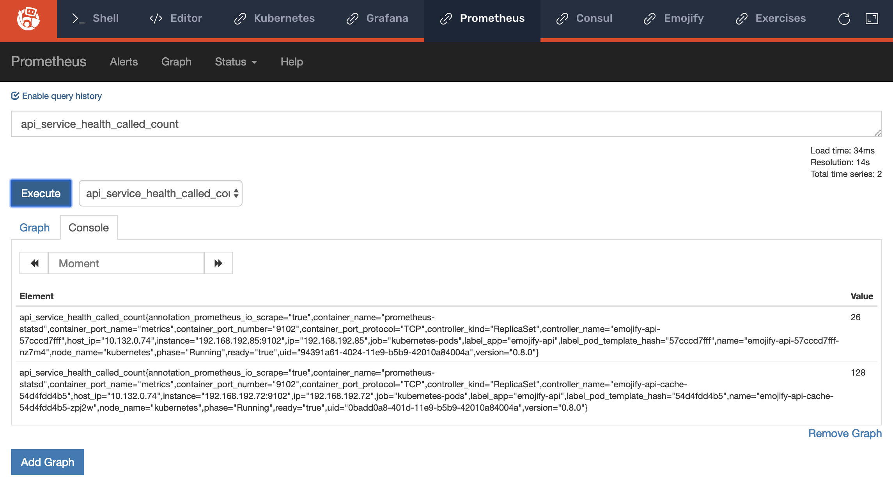

# Lab 03, Exercise 01: Configure Envoy Statistics

**Objective:** Configure a stats sink which will push statistics to an upstream collector.

## Background

TODO: add diagram

## Steps

First, navigate to this exercise's directory:

```
cd ~/service-mesh-training/exercises/lab-03/01-configure-envoy-statistics/
```

In `files/app` you'll find an updated set of Kubernetes configurations. If you compare these files with their counterparts from exercise 2, you'll notice a number of changes.

Briefly, what we're doing is:

- Replacing use of Kubernetes services to facilitate service-to-service communication and configuring Envoy proxies instead.
- Using Kubernetes configmaps to configure Envoy statistics.

Once you apply this change, the different components of the Emojify architecture will talk to each other though localhost, with Envoy proxying the requests.

Apply the updated configs with `kubectl apply`:

```
kubectl apply -f files/app

configmap/emojify-api-configmap created
deployment.apps/emojify-api configured
configmap/emojify-cache-configmap created
deployment.apps/emojify-cache configured
configmap/emojify-facebox-configmap created
deployment.apps/emojify-facebox configured
configmap/emojify-ingress-configmap configured
deployment.apps/emojify-ingress configured
secret/emojify unchanged
configmap/emojify-website-configmap configured
deployment.apps/emojify-website configured
```

To verify that Envoy has been configured properly and is collecting statistics by going to the **Prometheus** tab and running a query. Try `api_service_health_called_count` and you should see the following:


