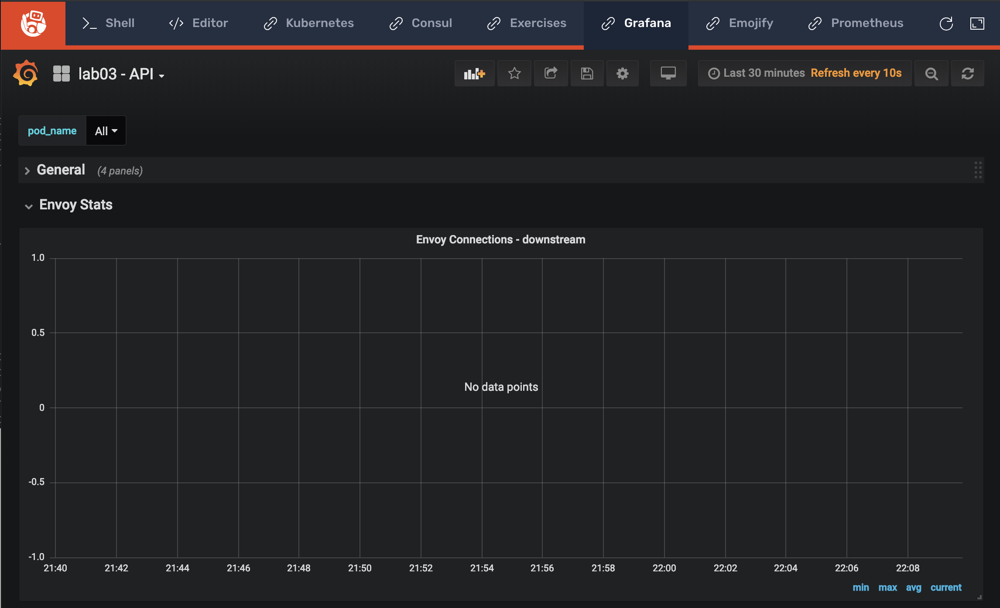
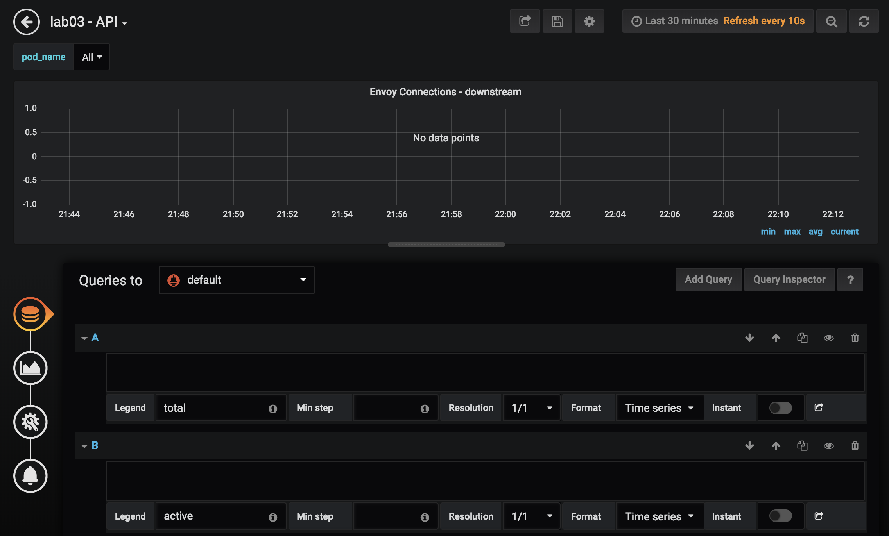

# Lab 03, Exercise 02: Downstream Connections

**Objective:** Create a visualization of downstream connections.

Go to **Grafana** tab in Instruqt. Open **lab03 - API** dashboard.



Edit **Envoy Connections** panel. You'll notice there are empty queries with pre-populated legends. You'll complete these queries in each of the next steps.



## Step 1: Total connections

In query with legend `total`:
```
sum(increase(envoy_http_downstream_cx_total{envoy_http_conn_manager_prefix="ingress_api", name=~"^$pod_name$"}[1m]))
```

## Step 2: Active connections

In query with legend `active`:
```
sum(increase(envoy_http_downstream_cx_active{envoy_http_conn_manager_prefix="ingress_api", name=~"^$pod_name$"}[1m]))
```

## Step 3: Remote connections destroyed

In query with legend `destroy-remote`:
```
sum(increase(envoy_http_downstream_cx_destroy_remote{envoy_http_conn_manager_prefix="ingress_api", name=~"^$pod_name$"}[1m]))
```

## Step 4: Local connections destroyed

In query with legend `destroy-local`:
```
sum(increase(envoy_http_downstream_cx_destroy_local{envoy_http_conn_manager_prefix="ingress_api", name=~"^$pod_name$"}[1m]))
```

